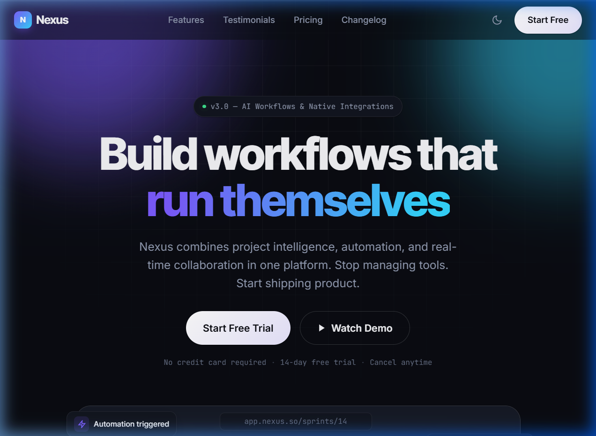
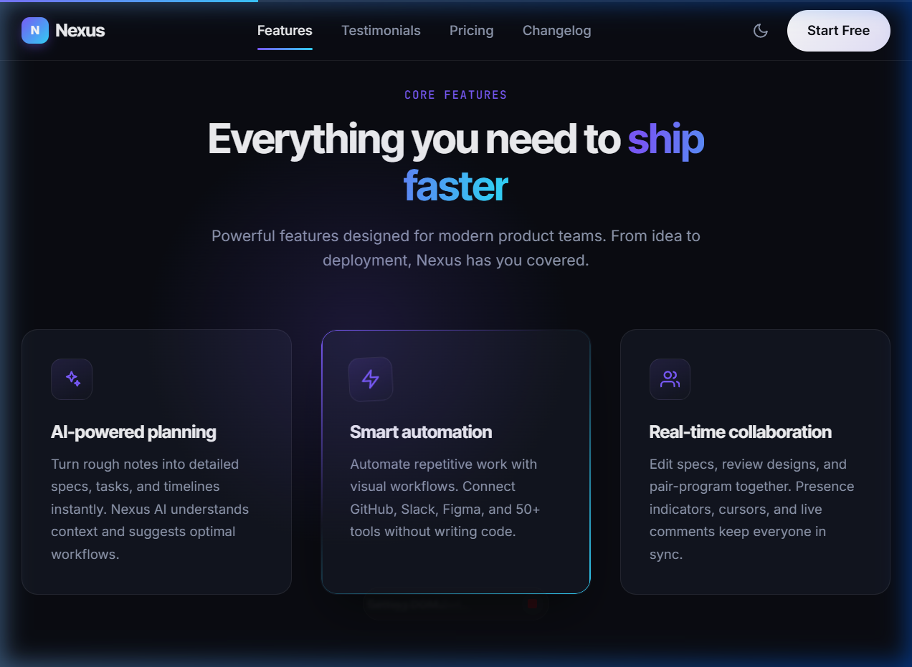

# Nexus — Build Workflows That Run Themselves

Nexus is a beautiful, premium, and fully responsive landing page designed for a modern AI-powered workflow platform. It features dark/light mode switching, scroll-driven reveal animations, custom cursor glow, magnetic button micro-interactions, and a simple billing interval toggle.

## 🚀 Live Preview (Screenshots)

### Main Landing Page Hero

---

### Core Features & Testimonials

---

## ✨ Features

- **Dynamic Theme Switcher**: Toggle seamlessly between dark and light modes, customized with elegant, fine-tuned HSL color variables.
- **Scroll Progress & Scroll Reveals**: Smooth scroll-linked progress indicator at the top of the viewport, combined with graceful viewport entry animations for sections and cards.
- **Interactive UI Components**:
  - **Magnetic Buttons**: Elements that subtly attract to the user's cursor for a premium feel.
  - **Cursor Glow**: An ambient radial gradient spotlight following the pointer on supported devices.
  - **Billing Toggle**: Switch between Monthly and Annual pricing packages with automatic price recalculation.
- **Fully Responsive & Clean Design**: Tailored layout using CSS Grid and Flexbox with fluid typography (`clamp()`) to ensure optimal viewing across mobile, tablet, and desktop devices.
- **A11y (Accessibility)**: Uses semantic HTML5, screen-reader utilities (`.sr-only`), skip-links, and clean focus outlines.

---

## 🛠️ Built With

- **HTML5**: Semantic tags and structure.
- **CSS3 (Vanilla)**: Grid, Flexbox, custom properties, animations, and container-based layouts (no external framework required).
- **JavaScript (Vanilla)**: Scroll listener, theme toggling, interactive animations, and responsive menu.
- **Fonts**: Inter, Inter Tight, and JetBrains Mono via Google Fonts.

---
